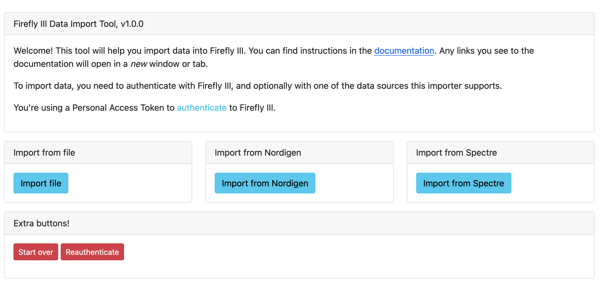
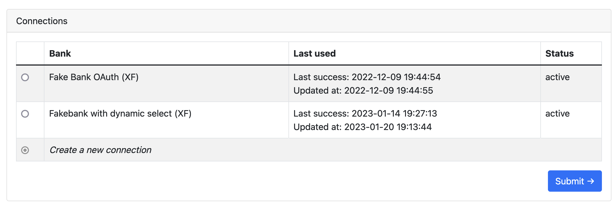

# Select a data source

## Introduction

Depending on how you installed the data importer, you can find it at any of the following urls:

- http://localhost:8080/
- http://localhost:81/

Browse to your data importer URL.

To import data first select your data source. You have the following choices:

1. Import from CSV or camt.053 files
2. Import from GoCardless
3. Import from Spectre

## Import a CSV file or a camt.053 file

You have to upload the file you wish to import. Optionally, you can upload a "configuration file". The configuration file is used to pre-set the import configuration, so you don't have to do it manually all the time.

!!! info "A note when importing CSV files"
    If the file contains any lines before the data starts, you must remove them manually. If there are extra headers (for example every 100 rows) you'll have to delete those too.

There may be a standard configuration file for your bank in **[this GitHub repository](https://github.com/firefly-iii/import-configurations)**. If not, it is OK to continue without a configuration file.

If you continue, you will end up at [the configuration screen](configure-import.md).

## Import from GoCardless

If you import from GoCardless, you can also optionally upload a GoCardless configuration file. Also, you may have to enter your GoCardless ID and GoCardless Key, if they are not part of the data importer's environment variables.

Read the page about [GoCardless and Spectre](../faq/spectre-and-nordigen.md) for more information about GoCardless.

After these settings, you must select your country and your bank of choice.

If you continue, you will end up at [the configuration screen](configure-import.md).

## Import from Spectre

If you import from Spectre, you can also optionally upload a Spectre configuration file. Also, you may have to enter your Spectre App ID and Spectre Secret, if they are not part of the data importer's environment variables.

Read the page about [GoCardless and Spectre](../faq/spectre-and-nordigen.md) for more information about GoCardless.

After these settings, you must select an existing connection, or create a new one.

If you continue, you will end up at [the configuration screen](configure-import.md).
