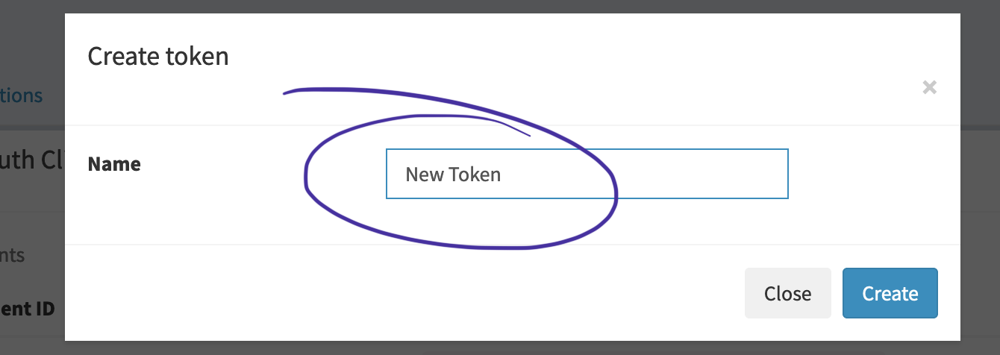

# Configure your installation

## Introduction

The Data Importer communicates with Firefly III over the [API](../../firefly-iii/api/index.md). 

On this page you will read how to:

1. Configure access to the API.
2. Configure Nordigen (optional)
3. Configure Spectre (optional)

## Access to the API 

### Firefly III URL

First, you must tell the data importer where to reach Firefly III. This is set in the `FIREFLY_III_URL` environment variable. REMOVE any trailing slash from the end of the URL.

In most cases, you can use `http://app:8080` which will be an internal reference to the Firefly III installation.

Since normal users can't reach this URL, you must also set the `VANITY_URL`. Here is an example:

* `FIREFLY_III_URL=http://app:8080` (internal Docker URL)
* `FIREFLY_III_URL=http://172.16.2.2:8080` (alternative scenario, internal Docker IP)
* `VANITY_URL=https://money.bill-gates.com` (public or local URL)

!!! note "Optional value"
    The `FIREFLY_III_URL` is optional. If you don't set it, the data importer will ask for the URL.

!!! warning "Docker and 127.0.0.1"
    Docker cannot connect to a Firefly III installation using `http://localhost` or `http://127.0.0.1` because this address refers to the Docker container itself, and not Firefly III.

### Authentication

To authenticate with Firefly III you must set ONE of the following variables:

1. Set a Personal Access Token in the `FIREFLY_III_ACCESS_TOKEN` environment variable.
2. OR Set a Client ID in the `FIREFLY_III_CLIENT_ID` environment variable.

!!! note "Authelia and other tools"
    Firefly III combined with [external identity providers](../../firefly-iii/advanced-installation/authentication.md) such as Authelia can only handle Personal Access Tokens.

## Configure Nordigen

If you wish to use Nordigen, please [read about Nordigen](../faq/spectre-and-nordigen.md) first. Then, set the following variables. This is necessary if you wish to connect to your bank through Nordigen.

* `NORDIGEN_ID` is your Nordigen Client ID
* `NORDIGEN_KEY` is your Nordigen Client Secret
* If you set `NORDIGEN_SANDBOX` to `true` the data importer will only connect to the Nordigen sandbox.

## Configure Spectre

If you wish to use Spectre, please [read about Spectre](../faq/spectre-and-nordigen.md) first. Then, set the following variables. This is necessary if you wish to connect to your bank through Spectre.

* `SPECTRE_APP_ID` is your Spectre / Salt Edge Client ID
* `SPECTRE_SECRET` is your Spectre / Salt Edge Client secret

## Where to set the configuration?

All the configuration values mentioned on this page are stored in environment variables:

* `FIREFLY_III_URL`
* `FIREFLY_III_ACCESS_TOKEN`
* `FIREFLY_III_CLIENT_ID`
* `NORDIGEN_ID` and `NORDIGEN_KEY`
* `SPECTRE_APP_ID` and `SPECTRE_SECRET`

You can use the `.env` file to store them, use Docker's `-e` flag to set them or use your operating system to set these values. This depends on your installation method, [Docker](docker.md) or [self-hosted](self-hosted.md).

!!! important "Cookie warning"
    You may need to clear your cookies, browse to `/flush` or press \[Reauthenticate\] after changing these values.

## How to get these variables?

### Personal Access Token

You can generate your own Personal Access Token on the Profile page. Login to your Firefly III instance, go to "Options" > "Profile" > "OAuth" and find "Personal Access Tokens". Create a new Personal Access Token by clicking on "Create New Token". Give it a recognizable name and press "Create". The Personal Access Token is pretty long. Use a tool like Notepad++ or Visual Studio Code to copy-and-paste it.





### Client ID + Firefly III URL

You can generate your own client ID on your Profile page (under OAuth). This is the ID you need when you want to share the data importer with multiple people, or when you want to allow others to use the same instance of the data importer.

Uncheck the "confidential" checkbox.

## Callback URL

It is **very important** that the callback URL is correct. The callback is the following:

```
http://[DATA IMPORTER]/callback
```

Some common examples include:

* [http://172.16.0.2/callback](http://172.16.0.2/callback) (172.16 is a common IP range for Docker hosts)
* [https://data-importer.home/callback](https://data-importer.home/callback) (Some users have fancy local addresses. Notice the TLS)
* [http://10.0.0.15/callback](http://10.0.0.15/callback) (10.0.0.x is often used when using Vagrant)

But ALWAYS add `/callback` or you'll run into weird errors later.


