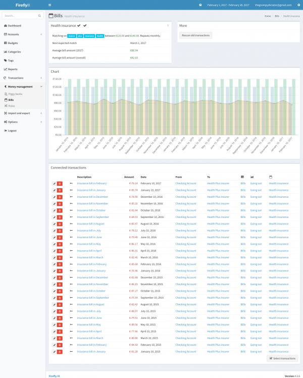

You can keep an eye on your expected recurring expenses by creating bills. Things like rent and utilities must be paid every month and Firefly III can keep track of such things.

When you create a bill, you tell Firefly III in what range you expect the bill to be. You also input the title of the bill, and how often the bill is expected to be paid.

* Minimum amount: 700,-
* Maximum amount: 800,-
* Description: Monthly rent
* Repeats every month

These properties by themselves are mostly cosmetic. They allow Firefly III to predict for you how much you should expect to spend on these bills. On the frontpage, a little box will tell you how you're doing.

## Triggering a bill

Once you have created a bill, Firefly III will suggest that you create a new rule that will match the bill. This rule is auto-filled to trigger on obvious things like the amount of the bill and the description you entered. Make sure you fine-tune the rule so any new transactions will auto-match the rule.

When you create a transaction with the following properties, it will match to the preceding example.

* Amount more than: 700
* Amount less than: 800
* Expense account: "Land lord"
* Description: "Rent"

This means that whenever a transaction matches these things, it will be linked to your bill.

Bills can only be linked to withdrawals.

## The date of a bill

When you create a bill you also have to fill in the (first) date you expect the bill to hit. This date is purely cosmetic and will be used to inform you when the bill can be expected. For example:

* A monthly bill, on the 3rd day of the month, will hit: 3 Jan, 3 Feb, 3 Mar, etc.
* A weekly bill, starting on 15 Jan, will hit: 15 Jan, 22 Jan, 29 Jan, 5 Feb, etc.

Keep in mind that weekly bills may fall outside of your expected range. At some point a weekly bill will hit 5 times in one month.

## Screenshots

The front page of Firefly III will also start showing the bills.

Individual bills will end up looking like this picture:

