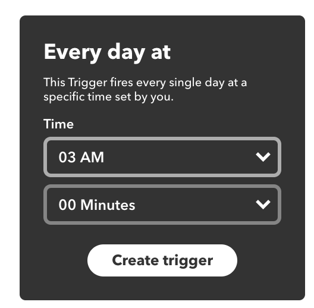
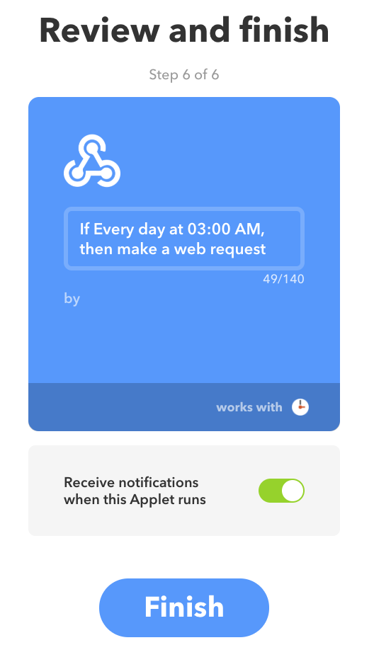

# Cron jobs

Firefly III supports several feature that requires you to run a cron job:

1. [Recurring transactions](../advanced-concepts/recurring.md). Firefly III can automatically create transactions for you. If Firefly III is to actually create these recurring transactions for you, someone or something must verify every single day if a new transaction is due to be created.
2. [Automatic budgeting](../concepts/budgets.md). Firefly III can automatically set your budgets for you.
3. [Warnings about bills](../advanced-concepts/bills.md). Firefly III will warn you when bills are ending or expected to be renewed or cancelled.

## Running the cron job

Here are several ways to run the cron job:

### Calling a command

If you are a bit of a Linux geek you can set up a cron job easily by running `crontab -e` on the command line. Some users may have to run `sudo crontab -u www-data -e` so the correct user will be referred to.

The content of the cron job must be as follows:

```   
# cron job for Firefly III
0 3 * * * /usr/bin/php /var/www/html/artisan firefly-iii:cron
```

You must make sure to verify `/usr/bin/php` with *your* path to PHP and replace `/var/www/html/` with the path to *your* Firefly III installation.

If you do this, Firefly III will generate the recurring transactions each night at 3AM.

### Request a page over the web

If for some reason you can't call scripts like this you can also use a tool called cURL which is available on most (if not all) linux systems.

The content of the cron job must be as follows:

```
# cron job for Firefly III using cURL
0 3 * * * curl https://demo.firefly-iii.org/api/v1/cron/[token]
```

Of course you must replace the URL with the URL of your own Firefly III installation. The `[token]` value can be found on your `/profile` under the "Command line token" header. This will prevent others from spamming your cron job URL.

### Use the systemd timer

If you prefer you can use `systemd` to run the jobs on a recurring schedule similar to cron. You will need to create two files: a unit file and a timer file.

Begin by creating a new file instructing systemd what to run, `firefly-iii-cron.service`.

```
[Unit]
Description=Firefly III recurring transactions
Requires=httpd.service php-fpm.service postgresql.service

[Service]
Type=oneshot
ExecStart=/usr/bin/php /var/www/html/artisan firefly-iii:cron
```

You will want to change the Requires= line to match the services that you are actually running. In this example we are using httpd (Apache), PHP FastCGI Process Manager (FPM), and PostgreSQL. Similarly, change the path to *your* path to the PHP binary and the path to *your* Firefly III installation.

Next create a new file for the timer specification, `firefly-iii-cron.timer`.

```
[Unit]
Description=Firefly III recurring transactions

[Timer]
OnCalendar=daily

[Install]
WantedBy=timers.target
```

Copy these files to `/etc/systemd/system`. You must then enable (`systemctl enable firefly-iii-cron.timer`) and start (`systemctl start firefly-iii-cron.timer`) the timer. Verify the timer is registered with `systemctl --list-timers`. You may also want to run the service once manually to ensure it runs successfully: `systemctl start firefly-iii-cron.service`. You can check the results with `journalctl -u firefly-iii-cron`.

### Make IFTTT do it

If you can't run a cron job, you can always make [If This, Then That (IFTTT)](https://ifttt.com) do it for you. This will only work if your Firefly III installation can be reached from the internet. Here's what you do.

Login to IFTTT (or register a new account) and create a new applet:


You will get this screen. Select "This":


Select "Date and Time":


Select "Every day at":


Set the time to 3AM:



Click on "That":


Use the search bar to search for "Webhooks".


Click on "make a web request"


Enter the URL in the following format. Keep in mind that the image shows the WRONG URL. Sorry about that.

`https://your-firefly-installation.com/api/v1/cron/[token]`

Of course you must replace the URL with the URL of your own Firefly III installation. The `<token>` value can be found on your `/profile` under the "Command line token" header. This will prevent others from spamming your cron job URL.


Press Finish to finish up. You can change the title of the IFTTT applet into something more descriptive, if you want to.


You will see a final overview



Press Finish, and you're done!

## Cron jobs in Docker

The Docker image does *not* support cron jobs. This is by design, because Docker images are designed to do one task. There are several solutions however.

### Static cron token

If you use Docker you may have noticed that in order to get the `<TOKEN>` mentioned all the time, you must first launch Firefly III, get the token from your profile, update the Docker configuration and then restart everything. Since this is hugely annoying, you may also set the `STATIC_CRON_TOKEN` to a string of **exactly** 32 characters. This will also be accepted as cron token. For example, use `-e STATIC_CRON_TOKEN=klI0JEC7TkDisfFuyjbRsIqATxmH5qRW`. Then, you can do:

```
# cron job for Firefly III using cURL
0 3 * * * curl https://demo.firefly-iii.org/api/v1/cron/klI0JEC7TkDisfFuyjbRsIqATxmH5qRW
```


### Call the cron job from outside the Docker container

Use any tool or system to call the URL. See the preceding documentation.

### Call the cron job from the host system

The command would be something like this:

```
0 3 * * * docker exec <container> /usr/local/bin/php /var/www/html/artisan firefly-iii:cron
```

Instead of `<container>`, write the container ID or write `firefly_iii_app` in case of Docker compose. If you want, you can replace `<container>` in the following piece of code, that will automatically insert the correct container ID. Keep in mind, it may need some fine tuning!

```
$(docker container ls -a -f name=firefly --format="{{.ID}}")
```

### Run an image that calls the cron job

Here's an example:

```
docker create --name=Firefly-Cronjob alpine sh -c "echo \"0 3 * * * wget -qO- <Firefly III URL>/api/v1/cron/<TOKEN>\" | crontab - && crond -f -L /dev/stdout"
```

Write your Firefly III URL in the place of `<Firefly III URL>` and put your command line token in the place of `<TOKEN>`. Both are can be found in your profile.

If you do not know the Firefly III URL, you can also use the Docker IP address.

### Expand the docker-compose file

```
cron:
  image: alpine
  command: sh -c "echo \"0 3 * * * wget -qO- http://app:8080/api/v1/cron/<TOKEN>\" | crontab - && crond -f -L /dev/stdout"
```

Write your Firefly III URL in the place of `<Firefly III URL>` and put your command line token in the place of `<TOKEN>`. Both are can be found in your profile.

You can also use `app` which is the default host name for Firefly III. Take note how this uses port 8080.

## Extra information

In order to trigger "future" cron jobs, you can call the cron job with `--force --date=YYYY-MM-DD`. This will make Firefly III pretend it's another day. This is useful for recurring transactions. Here is an example of a cron job that is triggered every first day of the month at 3am and pretends it's the tenth day of that month.

```
# cronjob for Firefly III that changes the target date.
0 3 1 * * /usr/bin/php /var/www/html/artisan firefly-iii:cron --force --date=$(date "+\%Y-\%m-")10
```
