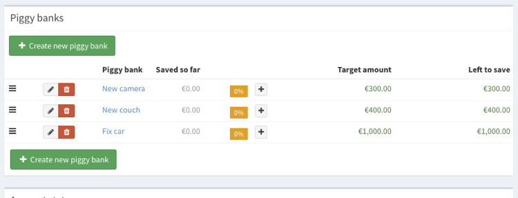
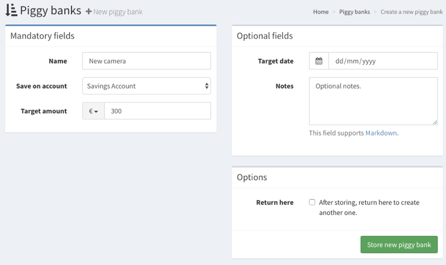

# Piggy banks

If you want to buy something expensive, you might need to save for it. You can use piggy banks to save money. You can find them under "Financial Control" > "Piggy banks". A piggy bank is meant to group money on an asset account together.

For example, on your savings account on which you have € 500,- saved. You want to buy a new digital camera, but you also need some money for a new couch, and you already know your car is going to break down sooner or later. You would need *three* piggy banks.

1. A piggy bank called "New camera", linked to your savings account. The target amount is € 300,-
2. A piggy bank called "New couch", linked to your savings account. The target amount is € 400,-
3. A piggy bank called "Fix car", linked to your savings account. The target amount is € 1000,-

To do so, use the button to create a new piggy bank. Fill in the details and select the correct asset account. The overview will then show you how your savings are divided over your three piggy banks.

## Concept

The idea is that you create a piggy bank for the money on your savings account. The money in your savings account can be added and removed to piggy banks freely. You can also transfer money in and out of your savings account and select a piggy bank to be associated with the transfer. The money will be added to (or removed from) the piggy bank as part of the transfer.

You can't create a withdrawal or a deposit and refer to a piggy bank. It only works for transfers. It won't work in rules either, just for transfers.

## Screenshots

