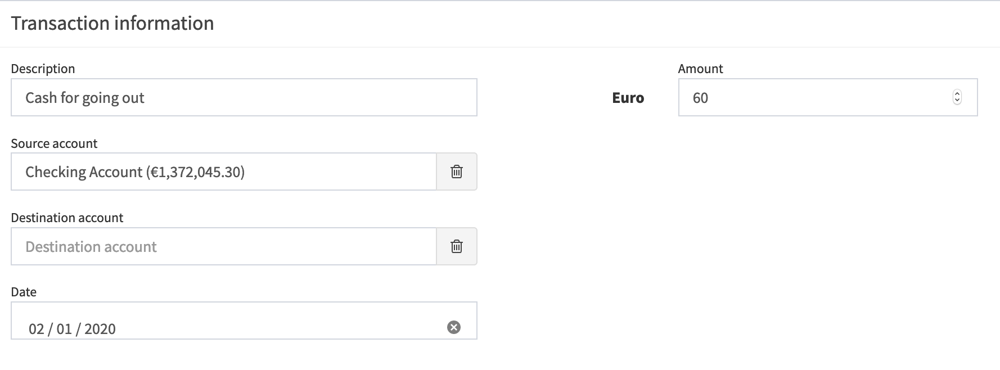
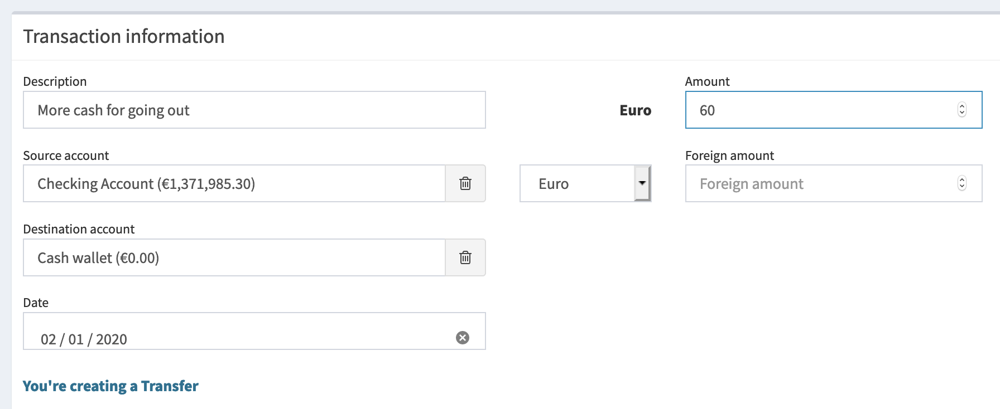
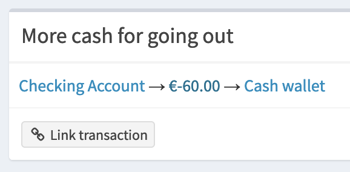
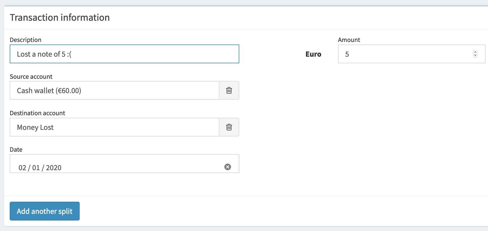
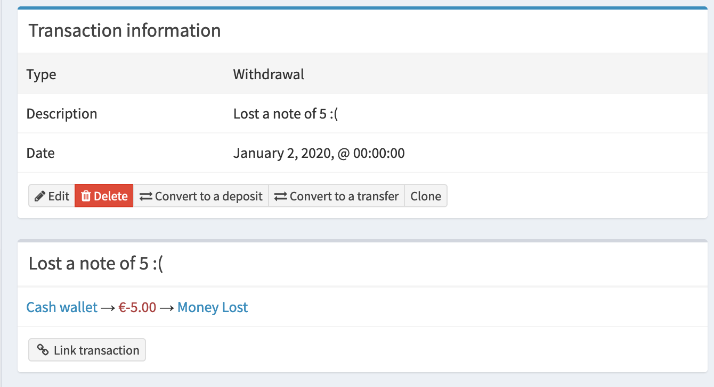
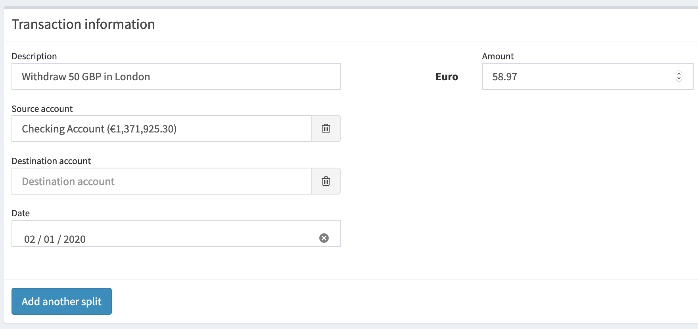
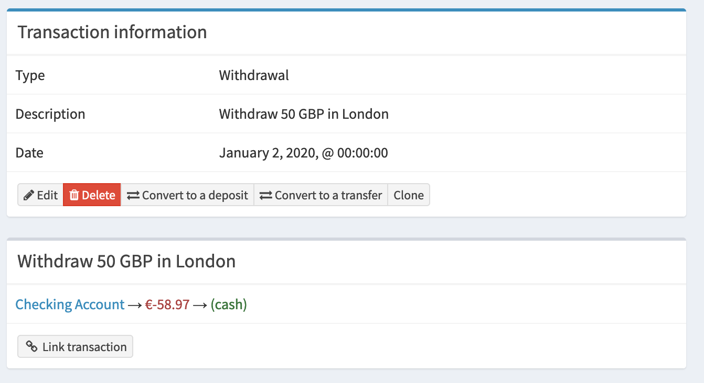
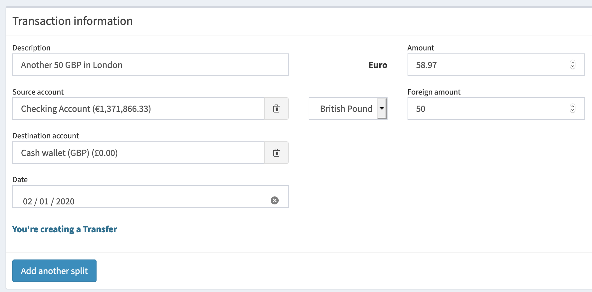

# Tracking cash

## Introduction

There are a few ways to manage your cash transactions in Firefly III. On this page you can read about them.

## Using the built-in "(cash)" account

The best way to manage cash in Firefly III, and the best way to manage your sanity, is _not_ to track your cash money. Instead, whenever you withdraw money from an ATM you consider the entire amount as lost, and you move on. This is useful when you use cash on but a few occasions like when you go out for drinks or when you pay the handy man, so he can avoid taxes.

To do this in Firefly III, whenever you withdraw cash you leave the "destination account" field empty, like so:

When you do this the transaction will simply mention _(cash)_ and the money is one big withdrawal:

This works the other way around as well, if you want to deposit cash into your checking account you just leave the Source Account field empty.

## With separate cash account

If you use cash a lot and when you want to keep track of it, you can create a cash wallet account or use the one built into Firefly III. That way, you can track all the cash you take from an ATM for example.

You put cash money into your wallet by transferring it from your checking account to your cash wallet, like so:

The result looks like this:

You can then spend your cash money as you please.

### Tracking lost money

If you use the "(cash)" account there's no need to do this.

But if you use the "cash wallet", you will run into a problem when you lose money, get short-changed or get robbed or something. Personally, I recommend spending money at "the abyss" or make an expense account with a similar amount like "money lost":

And the result is that you can see where you lost your money:

## Cash and multi-currency

If you go to an ATM and withdraw an amount in dollars when you always work with Euro's, you'll have to store the transaction in such a way that your balance still works out. If you use "(cash)":

If you use a separate cash account, you'll have to make sure the foreign currency is recorded correctly, _and_ you'll have to make a separate cash account to track these transactions.

