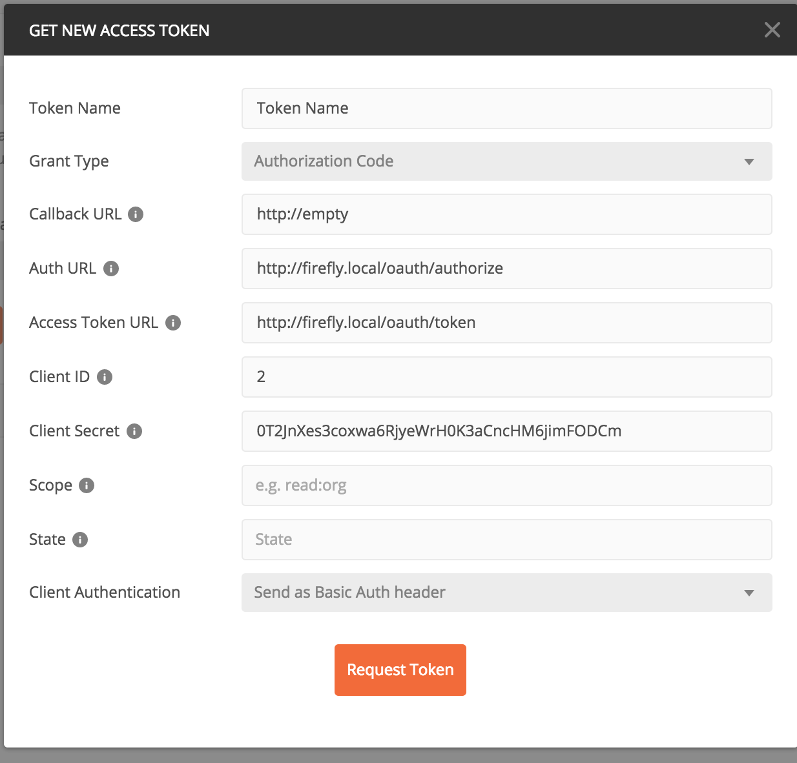
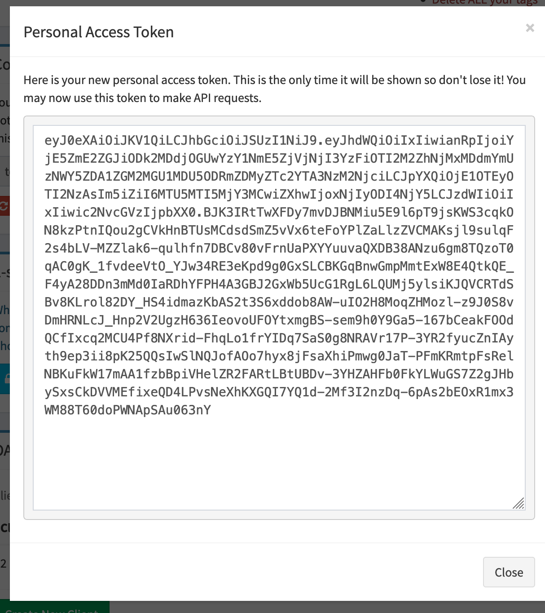

# How to use the API

The Firefly III API is a REST-based JSON API that you can use to talk to (almost) every aspect of Firefly III. If you're interested you can read [the full spec](https://api-docs.firefly-iii.org/).

Talking to the API can be done with any tool like Postman of simply cURL. Keep in mind that the [demo site](../../../explanation/firefly-iii/about/demo.md) of Firefly III will probably block your requests (this is to protect against script kiddies). Your own installation should work fine, however.

Firefly III offers the following end points that can be used in applications that support the OAuth2 workflow.

* `/oauth/authorize`
* `/oauth/token`

## Authentication

The API uses the OAuth2 workflow. You need to create OAuth2 Clients on the `/profile` when logged in.

## Create an OAuth2 client

Click "Create New Client" to create a new Client. Give it a name and enter the correct callback URL. If it all goes well, a new entry will appear in the list. It shows a Client ID and a secret. The secret can be exchanged for an access token. The access token is then used to access the API.

### Confidential

Some clients, like the data importer, can't keep a secret. So, if you uncheck the "confidential"-box, the client comes without a secret. This is necessary for the data importer but some other clients also need this.

For the data importer, uncheck the "confidential" checkbox. This is not necessary for other clients (that I know of).


### Callback URL

It is very important that the callback URL is correct. For the data importer, this is the correct callback URL:

```
http://[DATA IMPORTER]/callback
```

Some common examples include:

* [http://172.16.0.2/callback](http://172.16.0.2/callback) (172.16 is a common IP range for Docker hosts)
* [https://data-importer.home/callback](https://data-importer.home/callback) (Some users have fancy local addresses. Notice the TLS)
* [http://10.0.0.15/callback](http://10.0.0.15/callback) (10.0.0.x is often used when using Vagrant)

For the data importer, you must always add `/callback` or you'll run into weird errors later.

Other clients may have other callback URLs.

### Result

Here you see two OAuth Clients in my profile:


Here you see how Postman would use the secret to get an access token. What you can build in OAuth2 is out of the scope of this document.



## Personal Access Tokens

Some technical background. If your application can't or won't use OAuth2 you must generate a Personal Access Token. You can generate your own Personal Access Token on the Profile page. Login to your Firefly III instance, go to "Options" > "Profile" > "OAuth" and find "Personal Access Tokens".

Click on "create new token":


Give your token a name you recognize:


Copy the entire token. Yes, it's very long!



To use the token you have to pass an `Authorization: Bearer <token>` HTTP header. As an example in curl:

```bash
curl -X GET 'https://your-domain/api/v1/webhooks' \
  -H 'accept: application/vnd.api+json' \
  -H 'Authorization: Bearer [Personal Auth Token]' \
  -H 'Content-Type: application/json'
```

## It doesn't work

Many things can go wrong when you try to talk to the API. Even the data importer doesn't always work on the first try.

If you are trying to get the data importer to work, please [check out the FAQ](../../../references/faq/data-importer/general.md).

For other questions, use [the support page](../../../explanation/support.md) to contact me or open a discussion on GitHub.
