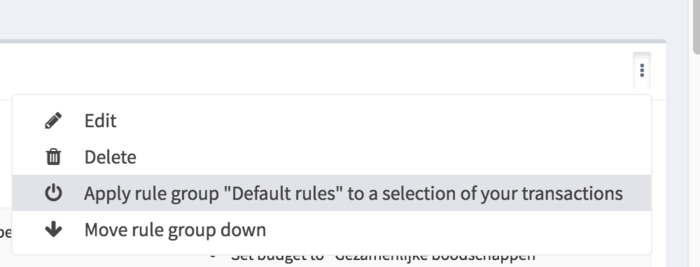

# How to use rules

Firefly III contains a powerful rule engine that can automatically update your transactions. It can do this when transactions are created or when they are changed. It works by combining "triggers" with "actions".

This is especially useful when you're importing data, and you wish all transactions to be updated at once. Or perhaps, you are too lazy to set the correct budget and category all the time, so you make a rule to do this for you.

Rules are divided in rule groups. Each rule group has rules in a specific order.

## Triggers

A rule must spring into action at the right time! This is decided by triggers that you can set yourself. Here are some notable rule triggers that people use often:

* When a transaction is created
* When the description is something specific
* When the amount is more than *X*.
* When the budget is *X*.

For a full list of triggers please check out [this reference of all rule triggers](../../../references/firefly-iii/rule-triggers.md).

Most triggers are case-insensitive, but depending on your database the triggers may be case-sensitive.

Rules can be set to be "strict" or not. If a rule is set to be strict, ALL triggers must match for the rule to fire. If a rule is not strict, ANY trigger is enough.

This can be useful if you wish to match multiple descriptions in one same rule, for example. If your transactions are described "groceries" or "went shopping" or "got food" then a *non-strict* rule could match all of them by adding 3 triggers with different content.

Triggers can be inverted, in which case they do the exact opposite.

## Actions

When the triggers are hit (either ALL or ANY, see the "strict" option), Firefly III will execute the associated rule actions. There are many actions available. Notable ones are:

* Change the budget, category, tag(s), description, amount
* Set a new description
* Change the source or destination account

Combined, this gives you a lot of power over your financial data. There is [a reference to the full list of actions](../../../references/firefly-iii/rule-actions.md).

You cannot fire other rules from a rule.

You can refer to a piggy bank from a rule action, so the transaction's amount will be added to (or removed from) the piggy bank. This will only work when the transaction is a transfer.

## Stop processing?

When you create a new rule, you can set an option called "stop processing". If you set it, and the rule is triggered, other rules in the group will NOT be processed anymore.

For any trigger, you can also set the "stop processing" option. If you do, and the trigger is hit, it will stop processing other triggers in the rule. Whether the actions get executed depends on how many triggers were fired so far. If you hit 2 out of 2 when "stop processing" was hit, the actions will fire.

For each action, you can set "stop processing" as well. When you do, any actions after the current one will not fire.

## Apply rules

You can apply your rules to existing transactions. On the rule-overview (page ``/rules``), either use the "on/off"-icon or the ellipsis menu in a rule group to apply entire rule groups or individual rules to your transactions. See for some screenshots below.

## Boolean logic

This feature of Firefly III is pretty advanced, even if I say so myself. It does not support complicated rules. Rules like "the budget must be Groceries and the shop must be A or B" combine different operators ("and" and "or"). This will not work.

## Errors

Rule actions may fail. For example, if a transaction has no category, a rule action to remove the category fails. Firefly III does not report this in the user interface because rules are often executed asynchronously. You can check the logs for errors.

If you set up a [Slack or Discord notification channel](../advanced/notifications.md), you will get these rule specific errors in your Slack or Discord channel.

## Can I use a rule (action) to create new transactions?

No. Please use [webhooks](../features/webhooks.md) for that.

## Screenshots

