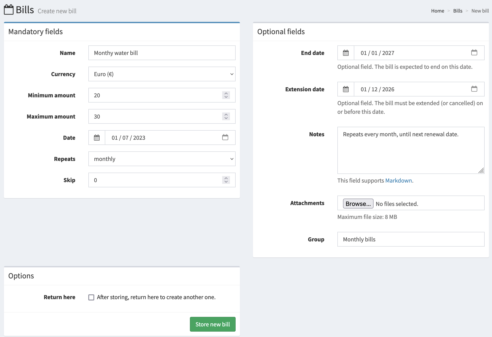

# How to use bills?

In Firefly III a "bill" is a record of a subscription or a recurring bill that you need to pay, like your rent or a Spotify subscription. You can read more about it in the [explanation about bills](../../../explanation/financial-concepts/bills.md).

You can create bills for your common recurring expenses. You can use [rules](../features/rules.md) to automatically link transactions to bills.

When you create a new bill, Firefly III asks you for the minimum and maximum amount that you expect the bill to be. This is important, because the average of these two amounts is used in charts and overviews.

## An overview of your bills

On this screenshot you see the bill overview from the demo site. You see that bills can have a variety of periods, and that they can be active and inactive.

You'll also see that Firefly III tells you when to expect the bill. 

The front page of Firefly III will also start showing the bills. This box takes the average expected amount of the bill (see ahead) and the amount already paid.

## Create a new bill

When you create a bill, you tell Firefly III the description and how often it repeats, etc., but also in what range you expect the bill to be.

You can also set the end date and the extension date. If you know [how to set up a cron job](../advanced/cron.md), Firefly III can alert you about these dates. 

If you enter a number in the "skip" field, the bill will be automatically skipped every X times; a bill that arrives every 3 months can be entered by filling in "2".

The minimum and maximum amount and the period allow Firefly III to predict for you how much you should expect to spend on these bills. On the frontpage, a little box will tell you how you're doing.  

After you create a bill you are automatically redirected to the page to create a new rule. You can learn [how to manage rules](../features/rules.md). This new rule is autofilled to trigger on obvious things like the amount of the bill and the description you entered. Fine-tune the rule so any new transactions will auto-match the rule. 

When you delete the bill, transactions associated with the bill will lose this association but will not be deleted.

### The date of a bill

When you create a bill you also have to fill in the (first) date you expect the bill to hit. This date is purely cosmetic and will be used to inform you when the bill can be expected. For example:

* A monthly bill, on the 3rd day of the month, will hit: 3 Jan, 3 Feb, 3 Mar, etc.
* A weekly bill, starting on 15 Jan, will hit: 15 Jan, 22 Jan, 29 Jan, 5 Feb, etc.

Keep in mind that weekly bills may fall outside your expected range. At some point a weekly bill will hit 5 times in one month.

## Bill overview

Individual bills will end up looking like this picture:

You see here the most important data of a bill, plus the transactions associated with a bill.
