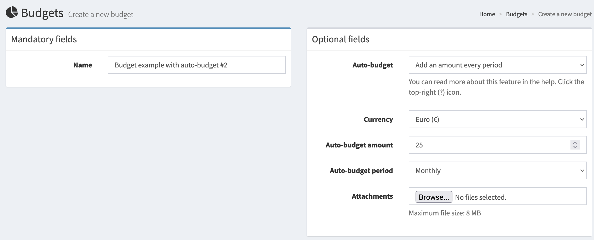

# How to manage budgets

Firefly III features budgets as a powerful way to manage your finances. To get started, visit the `/budgets` page and create your first budget. Just enter a name for now, nothing else.

Firefly III budgeting works best when you work from the first day of the month to the last. This is even true when you get paid weekly or 13 times a year (4-weekly). It's also true when you get paid some random moment in a month. For more information on this, read [the explanation on managing your personal finances](../../../explanation/firefly-iii/background/personal-finances.md).

## Basic budgets

Once you have a few budgets, you can link them to your expenses when you create a transaction. See also, [how to organize transactions](transactions.md).

This is not very useful yet. So, on the `/budgets` page you  can set the maximum amount for the budget. This amount applies to the current period and for most users  this applies to the current month. Monthly budgeting is a common way of organizing your finances.

## Automated budgets

!!! note
    I'm talking about months here, but this works equally well for weeks or quarters.

When the next month arrives, your budget amounts are gone, since they only applied to the previous month. You can set them again based on your experience from the previous month.

You can also make Firefly III do this for you. However, it requires that you know [how to run the cron job](../advanced/cron.md).

Auto-budgets are only created on the first day of the period they're set to. If the cron job does not run on that particular moment, the amount will not be set automatically. Hence, the cronjob should run daily.

| Auto-budget period | Moment amount is set     |
|--------------------|--------------------------|
| Daily              | Every day                | 
| Weekly             | Every Monday             | 
| Monthly            | First day of the month   |
| Quarterly          | First day of the quarter |
| Every half year    | June 1st, December 1st   |
| Yearly             | First day of the year    |

You can't edit or change these moments. They are hard-coded into Firefly III.

## Budgets that grow

You can also simply add money to the budget every month. That way, it grows every period. You start at 25, and if you spend nothing it grows to 50, 75, etc. every month.

## Budgets that grow, but correct for expenses

The previous trick works if you want unspent money to be available in the next month. But what happens when you spend way too much? Imagine a monthly 25,- budget. But you decide to spend 35,-. Now what? Using this little trick, Firefly III will set your next month's budget to 15,-, correcting for the 10,- overspend.

If you spend more than twice your allotted amount, Firefly III will set the next month's budget to a symbolic 1,-. It's up to you to decide how to deal with it.

## Mixing periods

Firefly III doesn't really handle mixed periods well. Setting both a yearly AND a monthly budget is tricky. You can do this by changing the view range on your `/preferences` page and then visit the `/budgets` page again. If these periods for a budget overlap too, your expense will be deducted from both amounts. Also, Firefly III will not automatically calculate what a yearly budget would be per month.
