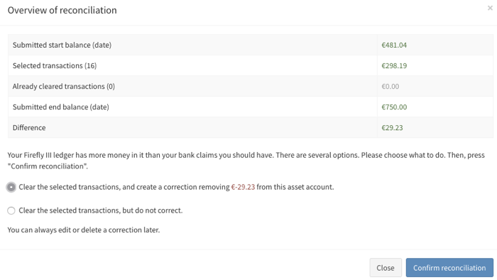

# How to reconcile accounts

Firefly III has a "reconciliation" view which allows you to verify that your transactions exactly match your account statement.
This can also help to resolve incorrect balances after importing a large set of historical transactions into Firefly III.

Open the reconcile view from either the Asset Accounts Listing (/accounts/asset) "actions" drop down menu, "Reconcile this account".

or from the Asset Account Home view (/accounts/show/123) 3 dot drop down menu, "Reconcile this account".

First, enter a date range and set the opening and closing balance as it shows on your account statement. 

For example:

* Start date: January 1st, 2018. Balance: € 120
* Ending date: January 31st, 2018. Balance: € 788

Next, press **Start reconciling** to continue.

Firefly III will show you the transactions from this range, plus a few previous and later dated transactions in case the transaction date differs from the account posted date.

For each transaction line on your account statement, find the matching transaction in Firefly III and check the box next to the amount column. Your goal is to verify that your Firefly III transactions exactly match your account statement. Go over your entire bank statement and check each transaction in Firefly III.  

If you find duplicate transactions, you can click on the transaction description to view the transaction, and from that page you can delete the transaction. After deletion, you will be returned to the reconcile page.

If you find incorrect transactions, you can click the "edit" pencil icon, to go into edit mode. After edited, you will be returned to the reconcile view.

After you have all the transactions matched (all boxes in the statement date range are checked), look at the amount at the top of the screen in the secito labeled "Reconciliation options". 

### Amount under "Reconciliation options" is less than zero

This means that your Firefly III asset account has less money in it than it should have. Look for duplicate transactions or incorrect amounts and correct them as needed. When you press the "Store reconciliation" button you can let Firefly III create an automated transaction to correct this difference. 

### Amount under "Reconciliation options" is more than zero

This means that your Firefly III asset account has more money in it than it should have. Look for missing transactions or incorrect amounts and correct them as needed. When you press the "Store reconciliation" button you can let Firefly III create an automated transaction to correct this difference. 

### Amount under "Reconciliation options" is exactly zero!

Congrats! This means that your Firefly III transactions exactly match your account statement. You can now press "Store reconciliation" to mark the checkmarked transactions as reconciled.

When you press the "Store reconciliation" button, Firefly III will present you with an overview of what you have just selected and ask you which action to take. You can let Firefly III generate a corrective transaction, or you can choose to ignore the difference. 

