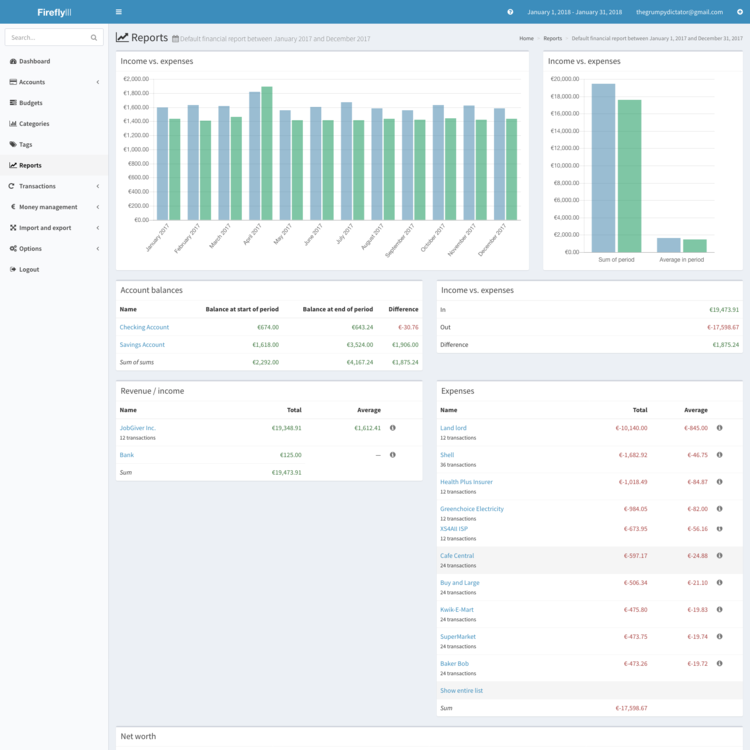
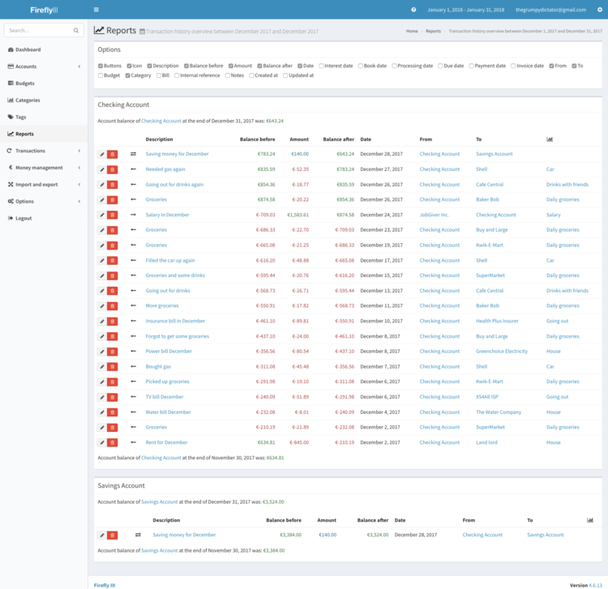
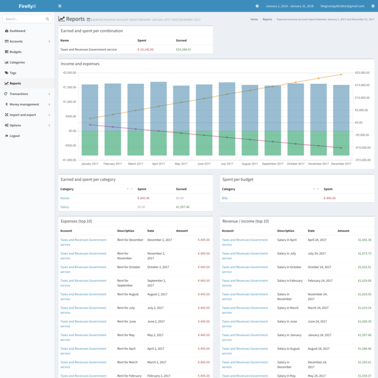
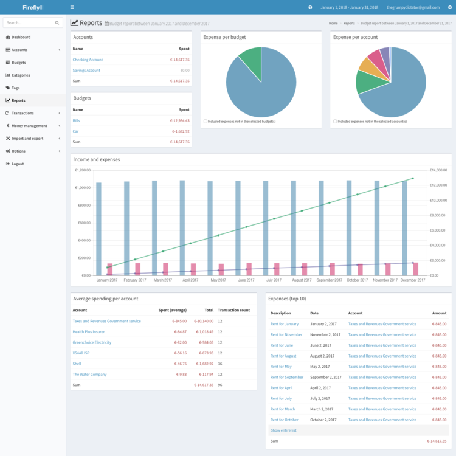

# Reports

Firefly III offers a variety of financial reports that can help you keep track of your finances. Each report has a certain scope that you can set to your liking:

* The asset accounts involved.
* The date range: from 1 day to 20 years
* Optionally, the budgets, categories or tags

This way you can create the exact cross-section of your finances you need.

## URL options

The URLs for reports look something like this: `/reports/default/1,2,3/20180101/20180131`. 

* `default` denotes the report type
* `1,2,3` is the list of asset accounts included in this report.

In this example, it is not difficult to see that `20180101` and `20180131` are dates: January 1st, 2018 and January 31st, 2018 respectively.

You can change these dates to your liking. There are a few magic words available that you can use instead of the exact date:

* `currentMonthStart`. Will return the start of the current month.
* `currentMonthEnd`. Will return the end of the current month.
* `currentYearStart`. Will return the start of the current year.
* `currentYearEnd`. Will return the end of the current year.
* `previousMonthStart`. Will return the start of the last month.
* `previousMonthEnd`. Will return the end of the last month.
* `previousYearStart`. Will return the start of the last year.
* `previousYearEnd`. Will return the end of the last year.
* `currentFiscalYearStart`. Will return the start of the current fiscal year, if you have set this in your preferences.
* `currentFiscalYearEnd`. Will return the end of the current fiscal year, if you have set this in your preferences.
* `previousFiscalYearStart`. Will return the start of the last fiscal year, if you have set this in your preferences.
* `previousFiscalYearEnd`. Will return the end of the last fiscal year, if you have set this in your preferences.

You can also replace `1,2,3` (which denotes the asset accounts to include in the report) with `allAssetAccounts` to include all of your asset accounts in the report.

## URL options for budget, category and tag reports

The URLs for these three report types look something like this: `/reports/budget/1,2,3/6,7,8/20180101/20180131`. 

As you can see a new parameter has appeared, `6,7,8` which indicates with objects the report should be about. These could refer to budgets, tags or categories, depending on the type of report you're viewing.

You can replace this second parameter with `allBudgets`, `allCategories` or `allTags` in order to include all the objects in the report.

## Available reports

The reports that are currently available are:

### Default financial report

The default report gives you a general overview of your finances. It lists your account balances with summaries, plus your expenses and incomes. It will also list your budgets, categories and bills, giving you insight in your current financial situation. You can click on the screenshot below for a large version.

Each table you see in the screenshot can be sorted by name, by amount, in reverse, etc. The charts have little hover-texts for added clarity and the (i)-buttons will give show more detailed information.

### Audit report

The audit report is meant to give you an exact overview of an asset account (or multiple). For each asset account it will list the start and end balance, and it can show every available field in a table, if you want to. It will also list the before / after balance for each transaction. This should make it easy to find possible mistakes in your administration. You can click on the screenshot below for a large version.

### Expense/revenue report

The expense/revenue report is meant for expense and revenue accounts that share the same name. Take for example your local Tax Department. You pay taxes, but perhaps you receive money back as well. Or when you work in retail, you might be able to buy stuff at a discount. This report shows you an overview of such accounts. You can click on the screenshot below for a large version.

### Budget report

This report shows you a detailed overview for the selected budgets *and* the selected account, allowing you to see how well you're doing for each selected budget. This is especially useful to see where you're spending your money, what the trend line is and if your budget limits are actually having any effect. 

Part of this information is also available on the default budget pages, and your front page. You can click on the screenshot below for a large version.

### Category report

This report is the same as the budget report but focuses on your categories. It can also include income, which can be very useful. Use this report to see on which specific things you unexpectedly spend a lot of money. Likewise, since it includes incomes, it can also be used to see if that raise you have received actually amounted to anything, after taxes. You can click on the screenshot below for a large version.

### Tag report

This report is the same as the category report but focuses on your tags. Use this report to see on which specific things you unexpectedly spend a lot of money. Likewise, since it includes incomes, it can also be used to see if that raise you have received actually amounted to anything, after taxes. You can click on the screenshot below for a large version.

